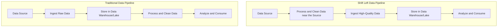
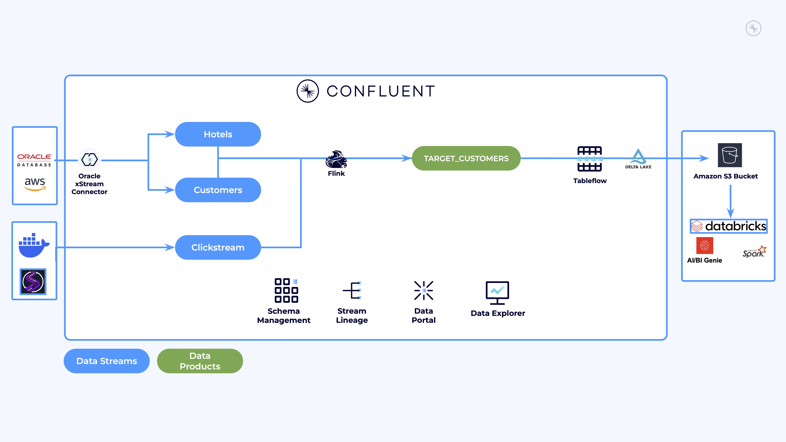
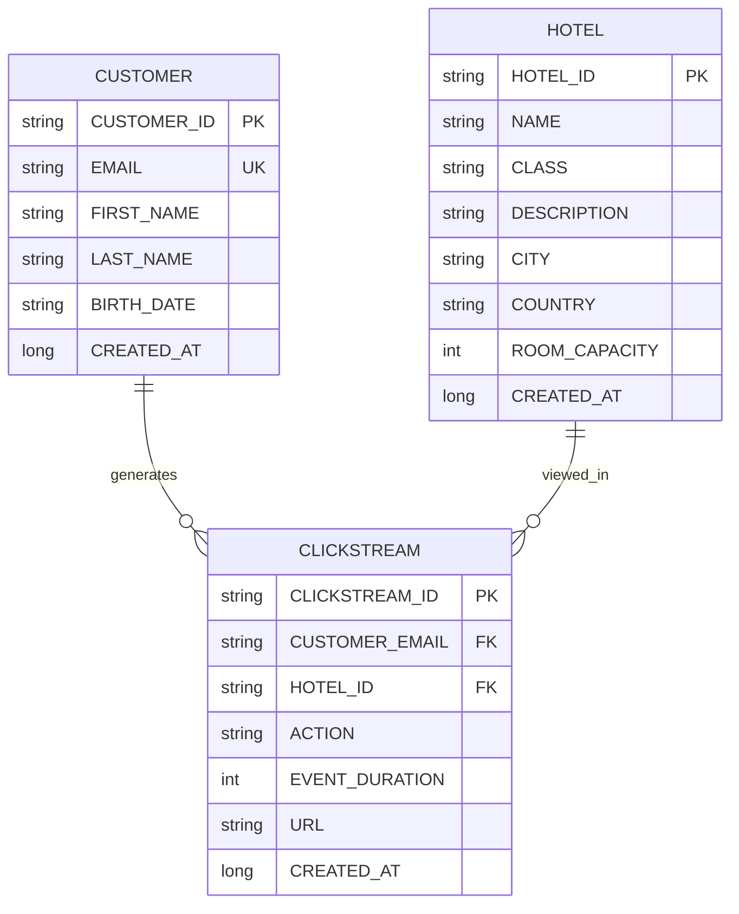
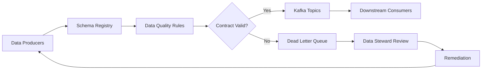

# Workshop: Shifting Left with Data Contracts

**Duration**: ~1 hour

**Difficulty**: Intermediate

**Technical Requirements**: Working knowledge of data streaming and schema management

## 📖 Overview

This hands-on workshop demonstrates how to **prototype data contracts as a [shift-left strategy](https://www.youtube.com/watch?v=FiZmyl1Npg0)** to prevent data quality issues before they impact downstream systems. You will play the role of a data engineer at *River Hotels*, a fictitious hospitality company, to **build a proof-of-concept** that showcases robust data governance practices and demonstrates how they ensure data reliability and prevent costly pipeline failures.

### Traditional vs Shift-Left

### Feedback

If you have any issues or feedback for this workshop, please let us know in this [quick 2-minute survey](https://docs.google.com/forms/d/e/1FAIpQLSfoVUqUFTAxHKJop7t8TvfZ4gItQxJ1RaM4oy72DjtK-HWoJg/viewform?usp=pp_url&entry.179681974=Shift+Left+with+Data+Contracts)!

## ✅ Prerequisites

You must complete each of these to successfully go through this workshop:

- Confluent Cloud account with admin privileges - [sign up for a free trial](https://www.confluent.io/get-started/)
- [AWS CLI](https://docs.aws.amazon.com/cli/latest/userguide/getting-started-install.html) installed and authenticated with an **AWS account** that has permissions to create resources
- Databricks account and existing workspace - can be a [free trial account](https://docs.databricks.com/aws/en/getting-started/express-setup) OR a [free edition account](https://login.databricks.com/?intent=SIGN_UP&provider=DB_FREE_TIER)
- [Terraform](https://developer.hashicorp.com/terraform/install) installed
- [Docker Desktop](https://docs.docker.com/get-started/get-docker/) installed
- [Git](https://git-scm.com/downloads) installed

## 🏨 Use Case

*River Hotels* is facing a critical data reliability crisis. Despite having a modern data infrastructure, they're experiencing frequent pipeline failures, inconsistent analytics, and eroded trust in their data products. The root cause? No formal data contracts or governance practices to prevent bad data from propagating through their systems.

### ⚠️ The Challenge

River Hotels' current approach to data management is reactive - they discover data quality issues only after downstream systems break or business reports show inconsistencies. This "firefighting" approach is unsustainable and costly, leading to delayed insights, missed business opportunities, and frustrated stakeholders.

The leadership team has called an emergency meeting where each department shares their pain points:

---

### 📊 The Analytics Dilemma

>*"We can't trust our customer behavior reports,"* explains the Head of Analytics. *"Last week, our clickstream data suddenly changed format without warning. Our customer segmentation models broke, and we had to spend three days rebuilding our entire pipeline. By then, the marketing campaign deadlines had passed."*

---

### 🔧 The Engineering Predicament

> The Engineering Manager shares equally frustrating experiences: *"Every time upstream teams make 'simple' changes to their data structures, our applications crash. We spend more time fixing data-related bugs than building new features. We need a way to catch these issues before they reach production."*

---

### 💼 The Business Impact

> The Chief Data Officer is concerned about the broader implications: *"Our data products are becoming unreliable. Business teams are losing confidence in our analytics, and we're making decisions based on incomplete or incorrect data. We need to shift our approach from reactive to proactive data governance."*

---

### 🎯 The Solution: Shift-Left Data Contracts

> Your CTO has made the directive clear: *"We need to implement data contracts that catch issues at the source, not at the destination. If we can shift data quality validation to the left - closer to where data is produced - we can prevent cascading failures and build trust in our data ecosystem."*

---

### 🎖️ Your Mission

Your task is to **build a proof-of-concept data contracts framework** that demonstrates how River Hotels can transform from a reactive data organization into a proactive, governed data ecosystem.

#### Solution Requirements

1. 📋 **Prototype** formal data contracts with schema registry
2. 🛡️ **Demonstrate** data quality rules that prevent bad data propagation
3. 🔄 **Showcase** schema evolution without breaking downstream systems
4. 🚨 **Implement** dead letter queues for contract violations
5. 📈 **Validate** the shift-left approach with an enriched data set

---

### 🛠️ What You'll Build

By the end of this workshop, you will have **prototyped a data contracts framework** that:

1. **Establishes Schema Registry**: Set up centralized schema management for all data streams
2. **Implements Data Quality Rules**: Create automated validation that prevents bad data from entering topics
3. **Handles Schema Evolution**: Safely evolve schemas while maintaining backward compatibility
4. **Manages Contract Violations**: Route invalid data to dead letter queues for review and remediation
5. **Provides Governance Visibility**: Monitor contract compliance and data quality metrics

**Important**: This is a **proof-of-concept environment** designed for learning and demonstration. For production deployment, additional considerations around feature sets, security, scalability, and operational monitoring would be required.

### 🎓 Key Learning Outcomes

- **Data Contracts**: Understand how to establish formal agreements between data producers and consumers
- **Schema Registry**: Learn to implement centralized schema management for data governance
- **Data Quality Rules**: Demonstrate automated validation to prevent bad data propagation
- **Schema Evolution**: Practice handling schema changes without breaking downstream systems
- **Shift-Left Strategy**: Experience proactive data governance practices in a controlled environment

**Focus**: This workshop emphasizes **hands-on learning** and **concept demonstration** rather than production deployment patterns.

## 🏛️ Architecture Overview

The following diagrams represent the **proof-of-concept data contracts architecture** you will implement and the governance framework that demonstrates data quality principles.

### 🔗 Entity Relationship Diagram

### 🌊 Data Contracts Pipeline

The data contracts architecture you'll implement follows this flow:

This architecture **demonstrates** proactive data governance by validating data contracts before issues propagate downstream.

## 🔬 Workshop Labs

This workshop is organized into six sequential labs that **build a proof-of-concept** step by step.

Each lab builds upon the previous one, so start with LAB 1 and continue until you are done.

- [LAB 1:](./assets/labs/LAB1_setup_terraform.md) Setup accounts and deploy infrastructure with Terraform
- [LAB 2:](./assets/labs/LAB2_data_organization.md) Prototype data contracts with schema registry and governance
- [LAB 3:](./assets/labs/LAB3_data_generation.md) Validate data contracts with realistic data generation
- [LAB 4:](./assets/labs/LAB4_data_schema_evolution.md) Test schema evolution and contract enforcement
- [LAB 5:](./assets/labs/LAB5_tableflow_databricks.md) Analytics with Tableflow and Databricks
- [LAB 6:](./assets/labs/LAB6_tear_down.md) Workshop cleanup and summary
- [RECAP:](./assets/labs/recap.md) Review takeaways from this workshop

## ➡️ What's Next

**Congratulations!** You've completed a comprehensive proof-of-concept for data contracts and shift-left governance.

### Feedback and Improvement

Please help us improve this workshop by leaving your feedback in this [quick 2-minute survey](https://docs.google.com/forms/d/e/1FAIpQLSfoVUqUFTAxHKJop7t8TvfZ4gItQxJ1RaM4oy72DjtK-HWoJg/viewform?usp=pp_url&entry.179681974=Shift+Left+with+Data+Contracts)!

Thanks!
