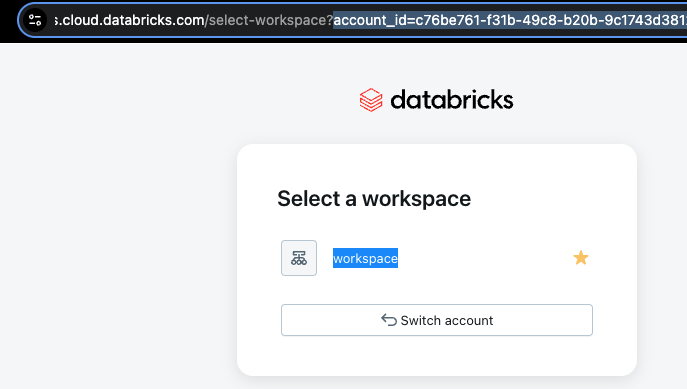
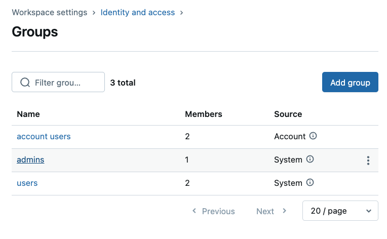
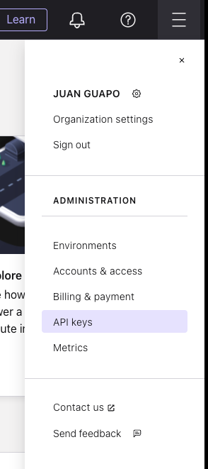

# LAB 1: Setup Accounts and Deploy Infrastructure

## 🗺️ Overview

Welcome to the foundation of your data contracts implementation! This lab establishes the infrastructure needed to demonstrate shift-left data governance principles at River Hotels. You'll create a "before" state that shows the problems data contracts solve.

### What You'll Accomplish

By the end of this lab, you will have:

1. **Multi-Cloud Infrastructure Deployment**: Use Terraform to automatically provision Oracle database on AWS and Confluent Cloud resources with proper security and networking
2. **Baseline Data Environment**: Establish uncontrolled data pipelines to demonstrate current pain points where data quality issues can propagate
3. **Foundation for Governance**: Deploy the infrastructure that will support data contracts and schema registry in subsequent labs

### Key Technologies You'll Use

- **Terraform**: Infrastructure as Code for automated multi-cloud resource provisioning and management
- **AWS Services**: EC2 for Oracle hosting and VPC for networking
- **Oracle XE**: Source database that will contain customer and hotel data
- **Confluent Cloud**: Fully managed Apache Kafka platform (initially without governance controls)

### The Business Context

This lab represents River Hotels' current state: infrastructure exists but lacks data governance. By the end, you'll have a working data pipeline that's vulnerable to the data quality issues that data contracts prevent.

### Prerequisites

Review the [README](../../README.md) and complete its [prerequisites](../../README.md#-prerequisites)

## 👣 Steps

### Step 1: Clone Repository

Get started by cloning the workshop repository and navigating to the Terraform configuration directory.

1. Open your preferred command-line interface, like *zsh* or *Powershell*
2. Navigate to your preferred location for creating projects
3. Clone this repository with git:

   **HTTP:**

   ```sh
   git clone https://github.com/confluentinc/workshop-data-contracts.git
   ```

   **SSH:**

   ```sh
   git clone git@github.com:confluentinc/workshop-data-contracts.git
   ```

4. Navigate to the Terraform directory:

   ```sh
   cd workshop-data-contracts/terraform
   ```

### Step 2: Configure Cloud API Keys and Accounts

Terraform requires API keys and configuration values to create resources across multiple cloud platforms. You'll configure these values in a `terraform.tfvars` file.

#### Create Terraform Override File

1. Copy the sample configuration file:

   ```sh
   cp sample-tfvars terraform.tfvars
   ```

2. Open `terraform.tfvars` in your preferred editor

   The file should look like this:

```hcl
# ===============================
# General Overrides
# ===============================
email        = ""
cloud_region = ""
call_sign    = ""

# ===============================
# Confluent Cloud Overrides
# ===============================
confluent_cloud_api_key    = ""
confluent_cloud_api_secret = ""

# ===============================
# Databricks Overrides
# ===============================
databricks_account_id                      = ""
databricks_service_principal_client_id     = ""
databricks_service_principal_client_secret = ""
databricks_host                            = ""
databricks_user_email                      = ""
```

3. Enter a value for the `call_sign`, where call sign is a short name or nickname that will be prefixed to all cloud resources, making them easier to identify in the UI

#### Databricks

There are many values to add from Databricks, and these steps will guide you through the process:

##### Sign up/Login

Navigate to [Databricks](https://login.databricks.com/) and login with your account.

> [!NOTE]
> **Create Databricks Account**
>
> If you don't have an existing databricks account, you can create a *recommended* [free trial account](https://login.databricks.com/?intent=signup) (make sure to click the *Continue with Express Setup* button).
>
> Alternatively and not recommended, you can try to use a [free edition account](https://login.databricks.com/?intent=SIGN_UP&provider=DB_FREE_TIER).
>
> Either of these account types should be compatible with the exercises in this workshop, but they each have pros/cons and limitations.

##### Get Databricks IDs

###### Account ID For Paid or Free Trial Accounts

1. Open a separate browser tab to the [Databricks Admin Console](https://accounts.cloud.databricks.com/)
2. Click on the user icon in the top right

   

3. Copy the **Account ID** value and paste it into your `terraform.tfvars` file for the `databricks_account_id` key

###### Account ID For Free Edition Accounts

1. Open a separate browser tab to the [Databricks Admin Console](https://accounts.cloud.databricks.com/)
2. Find the `account_id=` in the browser tab url and copy the value
   
3. Paste it into your `terraform.tfvars` file for the `databricks_account_id` key

###### Additional Databricks IDs

1. Click on the *SQL Editor* link in the left navigation
2. Paste this query into the editor and execute it:

```sql
-- This returns the cloud region where your databricks account resides
SELECT
   m.metastore_name,
   m.metastore_id,
   m.cloud,
   m.region
FROM
   system.information_schema.metastores as m;
```

3. Copy the *region* value (e.g. `us-west-2`, `us-east-2`, etc.) and paste it into your `terraform.tfvars` for the `cloud_region` variable override. If more than one record is returned, then pick the metastore that's associated with your workspace and use that *region* value

4. Copy the *URL* from your browser address bar and paste it into your `terraform.tfvars` for the `databricks_host` variable override. Erase everything after the *databricks.com*. It should look similar to this: `https://dbc-12f34e56-123e.cloud.databricks.com`

5. Click on the user profile circle in the top right of the databricks screen

   

6. Copy your account's email address and paste it into your `terraform.tfvars` for the `databricks_user_email` variable override
7. You can paste the same email address in the `email` variable override in `terraform.tfvars`, or you can paste a different one

##### Create Service Principal

In this step you will create a [Service Principal](https://docs.databricks.com/aws/en/admin/users-groups/service-principals) to authenticate automated tasks, like Terraform, in your Databricks account.

1. Click on your username in the top right bar and select *Settings*
2. Click on *Identity and access*
3. Click the *Manage* button next to *Service principals*

   

4. Click on the *Add service principal* button
5. Click on the *Add new* button
6. Enter a descriptive name in the textbox, something like *workshop-tableflow-databricks*

   

7. Click on the *Add* button

##### Create OAuth Secret for Service Principal

1. Click on your newly-created Service Principal
2. Click on the *Secrets* tab
3. Click on the *Generate secret* button
4. Enter a reasonable duration lifetime, something like `30` or above

   

5. Click the *Generate* button
6. Copy and paste the `Secret` and `Client ID` into the corresponding databricks Terraform variables in your `terraform.tfvars` file

   

7. Click on the *Done* button

##### Add Service Principal to Admin Group

1. Click on the *Identity and access* link under the *Settings* heading
2. Click on the *Manage* button next to the *Groups* section
3. Click on the *admins* link

   

4. Click on the *Add members* button
5. Search for the name of the Service Principal you just created and select it from the dropdown

   

6. Click on the *Add* button

##### Databricks Setup Complete

You have completed the Databricks set up and now are ready to configure your Confluent Cloud account.

#### Configure Confluent Cloud

Follow these steps to create a Confluent *Cloud resource management* API key and secret.

##### Login and Create API Key

1. Open up a new web browser tab and login to your Confluent Cloud account
   - If you don't yet have one, sign up for a trial [here](https://www.confluent.io/confluent-cloud/tryfree/?utm_campaign=tm.fm-ams_cd.Build-an-AI-Powered-Personalization-Engine_id.701Uz00000fEQeEIAW&utm_source=zoom&utm_medium=workshop)
2. Click on the menu icon in the top right of the screen
3. Click on *API keys*

   

4. Click on the *+ Add API key* button
5. Select *My account*
6. Click *Next*
7. Select *Cloud resource management*

   

8. Click *Next*
9. Enter a name like *Data Contracts Shift Left Workshop*
10. Add a useful description
11. Click the *Create API Key* button

##### Add API Key and Secret to Terraform

1. In your code editor, open your `terraform.tfvars` file and enter the `confluent_cloud_api_key` and `confluent_cloud_api_secret` values from your newly-created **Key** and **Secret**. Save the file.
2. Back in Confluent Cloud, click the *Complete* button

> [!WARNING]
> **Payment Info or Promo Code Required**
>
> You must add either credit card info or a provided coupon code to be able to run this workshop

#### Configure AWS

With the AWS CLI already installed, follow [these instructions](https://docs.aws.amazon.com/cli/latest/userguide/getting-started-quickstart.html) to configure and authenticate it with your AWS account.

> [!IMPORTANT]
> **AWS Workshop Studio Accounts**
>
> If you are using an AWS Workshop Studio account, click on the **Get AWS CLI credentials** link on your event home screen and follow the instructions.
>
> 

Verify that you are authenticated with the AWS CLI by invoking this command

```sh
aws configure list
```

You should see an output like this:

```sh
 Name                    Value             Type    Location
      ----                    -----             ----    --------
   profile                <not set>             None    None
access_key              ************             env
secret_key              ************             env
    region                **********             env    ******
```

### Step 3: Deploy Cloud Infrastructure with Terraform

Now you'll deploy the infrastructure that demonstrates the "before" state - a working data pipeline without governance controls.

#### Initialize and Validate Terraform

First, initialize your Terraform workspace:

```sh
terraform init
```

You should see this success message:
> ✅ Terraform has been successfully initialized!

Next, verify that your configuration is valid:

```sh
terraform validate
```

You should see this success message:
> ✅ Success! The configuration is valid.

#### Deploy Infrastructure

Execute the deployment:

```sh
terraform apply -auto-approve
```

You should see extensive log output showing the progress of creating cloud resources. When finished, you should see:

> ✅ Apply complete! Resources: XX added, 0 changed, 0 destroyed.

#### Infrastructure Overview

Here's what Terraform should have created for you:

**AWS Resources:**

- VPC with proper networking components
- Security groups with minimal required access
- EC2 instance running Oracle XE database
- S3 general-purpose bucket
- IAM roles and policies for secure access

**Confluent Cloud Resources:**

- Environment for workshop isolation
- *Standard* Kafka cluster for data streaming
- Schema Registry (initially empty - this demonstrates the problem)

**Databricks Resources:**

- External Location to access S3 bucket
- Storage Credential for secure access

View your infrastructure details anytime with:

```sh
terraform output
```

> [!NOTE]
> **Troubleshoot Terraform Issues**
>
> If terraform fails, review common solutions in [troubleshooting.md](./troubleshooting.md#terraform).

### Step 4: Verify Infrastructure Deployment

You can optionally verify that your infrastructure is properly deployed and accessible.

#### Verify AWS Resources

1. Log into the AWS console with the same account used in Terraform
2. Select the same *cloud region* as specified in your Terraform variables
3. **Confirm EC2 Instance Status**:
   1. Navigate to EC2 Dashboard
   2. Click *Instances* in the left navigation
   3. Find your instance (contains your call_sign)
   4. Verify status shows "Running"

#### Verify Confluent Cloud Resources

1. Navigate to your Confluent Cloud account
2. Find and click on your workshop environment
3. Click on your workshop cluster
4. Click *Topics* in the left sidebar
5. Verify that there are **no topics yet** - this is expected
6. Click *Schema Registry* in the left sidebar
7. Notice there are **no schemas** - this represents the ungoverned state

## 🏁 Conclusion

**Congratulations!** You've successfully deployed the baseline infrastructure for River Hotels' data contracts workshop.

### What You've Achieved

You now have a working data infrastructure that represents the "before" state:

- ✅ Data can flow through the system
- ❌ No schema governance to prevent data quality issues
- ❌ No contracts to catch breaking changes
- ❌ No data quality rules to validate content

This ungoverned state is exactly what causes the data reliability problems that data contracts solve.

### The Business Impact

Your current infrastructure mirrors many real-world environments where:

- Data flows freely but without quality guarantees
- Schema changes can break downstream systems without warning
- Data quality issues propagate throughout the organization
- Teams may lose trust in data products

## What's Next

In [LAB 2](./LAB2_data_organization.md), you'll transform this ungoverned environment by implementing schema registry, data contracts, and governance policies that prevent data quality issues before they impact downstream systems.
