# LAB 2: Prototype Data Contracts

## 🗺️ Overview

Transform your uncontrolled data environment into a **governed proof-of-concept** using Confluent's catalog management and data contract framework. This lab **demonstrates** the schema registry and governance policies that prevent data quality issues before they propagate downstream.

### What You'll Accomplish

By the end of this lab, you will have:

1. **Schema Registry**: Centralized schema management for all data streams with version control
2. **Data Contracts Creation**: Formal agreements between data producers and consumers that help preserve data quality
3. **Metadata Management**: Business context and ownership information for data governance
4. **Governance Foundation**: Tags, templates, and policies for encouraging data stewardship

### Key Technologies You'll Use

- **Confluent Schema Registry**: Centralized schema versioning and compatibility management
- **Data Contracts**: Formal schema agreements with business context
- **Business Metadata**: Ownership and stewardship information
- **Data Governance Tags**: Classification and policy enforcement

### Prerequisites

- Completed [LAB 1](./LAB1_setup_terraform.md) with all infrastructure deployed
- Confluent Cloud environment and cluster running
- AWS resources deployed and accessible

## 👣 Steps

### Step 1: Enable Data Governance Framework

First, you'll establish the foundational governance tools that make data contracts effective.

#### Navigate to Catalog Management

1. Login to your Confluent Cloud account
2. Find and click on your workshop environment
3. Click on **Catalog Management** in the left menu

   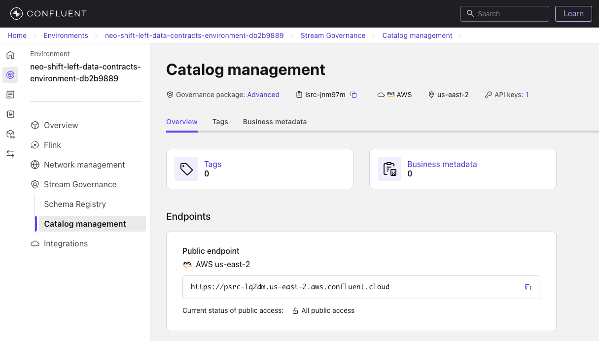

The catalog management system provides the foundation for data governance by organizing schemas, metadata, and policies.

#### Create Governance Tags

Tags help classify data streams and apply consistent policies across your organization.

1. Click on the **Tags** tab
2. Click on the **Create tags** button
3. Check the boxes for these recommended tags:
   - *PII* - Personally Identifiable Information
   - *Private* - Internal business data
   - *Public* - Data safe for external sharing

   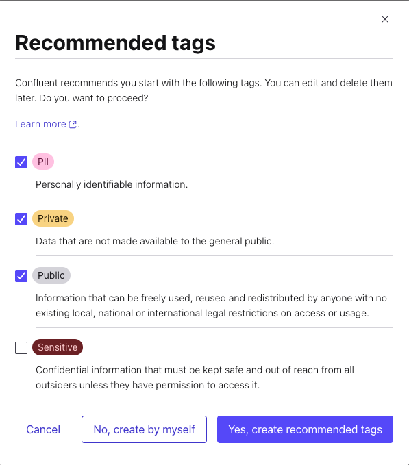

4. Click **Yes, create recommended tags**

5. **Create Custom Business Tag**:
   1. Click the **+ Add Tag** button
   2. Enter `KPI` in the *Tag Name* field
   3. Select any color you prefer
   4. Copy this description into the *Description* field:

   ```text
   A designation for fields that River Hotel leadership have identified as drivers for Key Performance Indicator metrics
   ```

   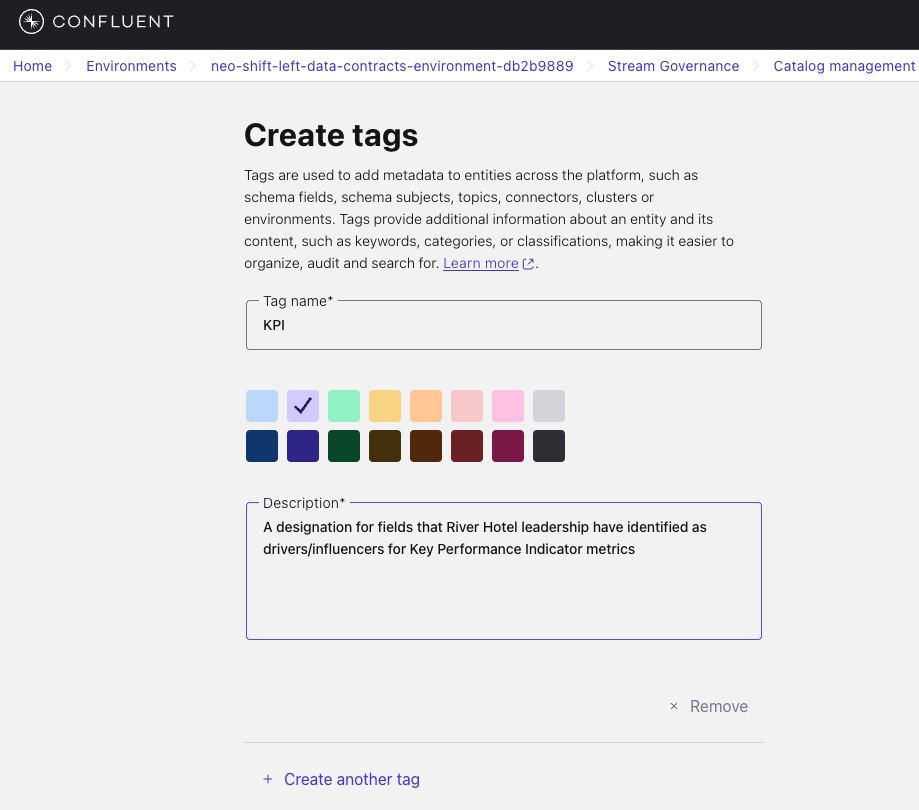

   5. Click **Create**

6. Review your complete tag list:

   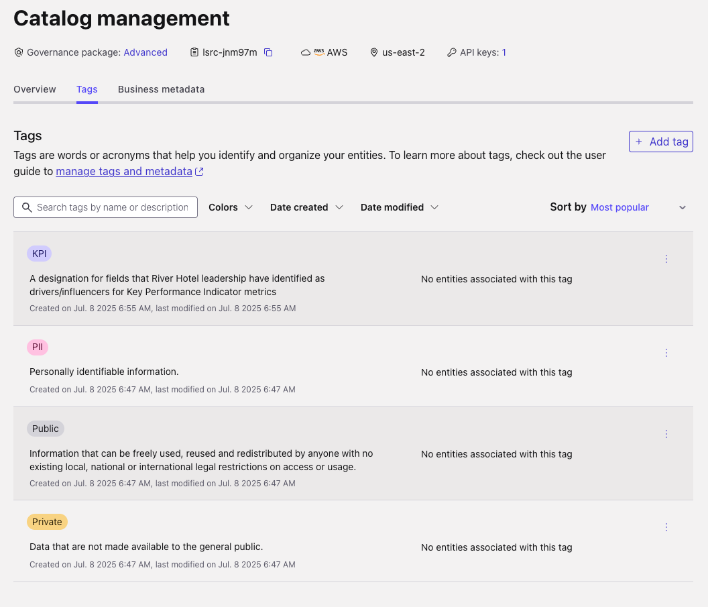

**Why This Matters:** Tags enable automated data governance policies and help stakeholders understand data classification at a glance.

#### Establish Business Metadata Template

Business metadata connects technical schemas to business context and ownership.

1. Click on the **Business Metadata** tab
2. Click **Create business metadata**
3. Configure the stewardship template:
   - *Name:* `Stewardship`
   - *Description:* `Contact information for the steward of the corresponding data`
   - *Attribute 1:* `First_Name`
   - Click **Create attribute**
   - *Attribute 2:* `Last_Name`
   - Click **Create attribute**
   - *Attribute 3:* `Email`

   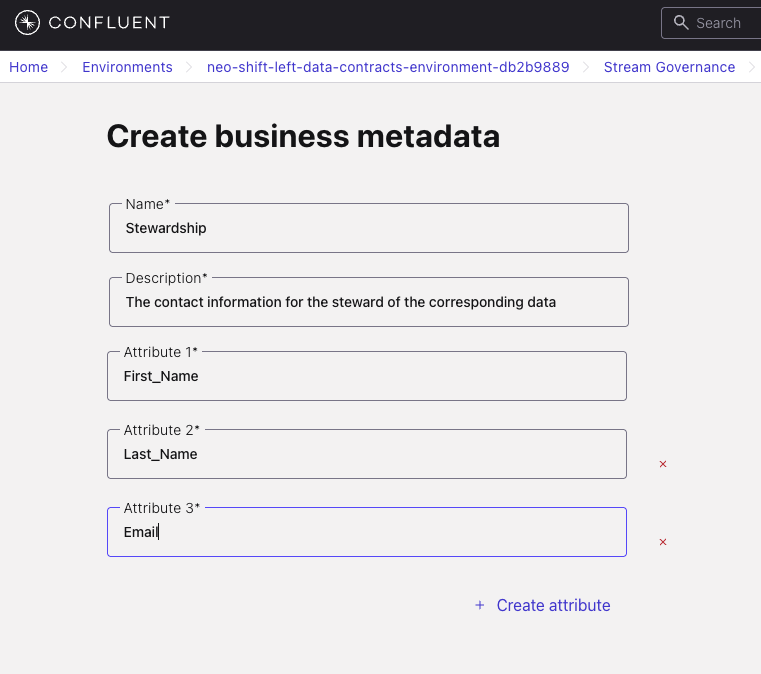

4. Click **Create**

**Business Value:** This template ensures every data contract has clear ownership and accountability.

### Step 2: Implement Data Contracts

Now you'll create the core data contract that prevents data quality issues.

#### Access Schema Registry

1. Click **Schema Registry** in the left menu
2. Notice there are currently **no Data Contracts or Rules** - this represents the ungoverned state

   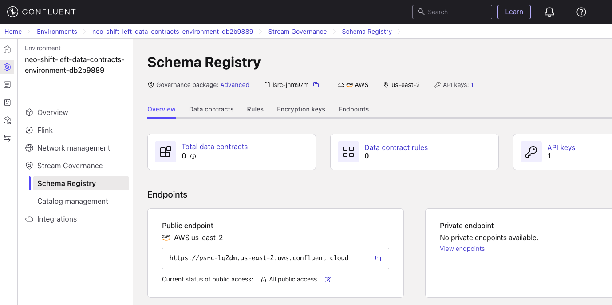

#### Create Your First Data Contract

You'll create a data contract for clickstream data that enforces schema compatibility and data quality.

1. Click the **Data contracts** tab
2. Click **Add data contract**
3. Enter the subject name: `clickstream-value`

> [!IMPORTANT]
> **Subject Naming Strategy**
>
> Confluent uses *[TopicNameStrategy](https://developer.confluent.io/courses/schema-registry/schema-subjects/#topicnamestrategy)* by default, which means:
>
> - Topic: `clickstream` → Subject: `clickstream-value`
> - This naming convention links schemas to topics automatically

4. **Define the Schema Contract**:

   Copy and paste this schema into the editor:

```json
{
      "type": "record",
      "namespace": "com.riverhotel.poc",
      "name": "clickstreamEvent",
      "doc": "Customer activity on River Hotel catalog website",
      "fields": [
         {
            "name": "CLICKSTREAM_ID",
            "type": "string"
         },
         {
            "name": "CUSTOMER_EMAIL",
            "type": "string"
         },
         {
            "name": "HOTEL_ID",
            "type": "string"
         },
         {
            "name": "ACTION",
            "type": "string"
         },
         {
            "name": "EVENT_DURATION",
            "type": "int"
         },
         {
            "name": "URL",
            "type": "string"
         },
         {
            "name": "CREATED_AT",
            "type": {
                  "type": "long",
                  "flink.precision": 3,
                  "flink.version": 1,
                  "logicalType": "local-timestamp-millis"
            }
         }
      ]
}
```

5. **Validate the Schema**:
   1. Click **Validate schema**
   2. Verify you see green checkmarks for syntax and compatibility

   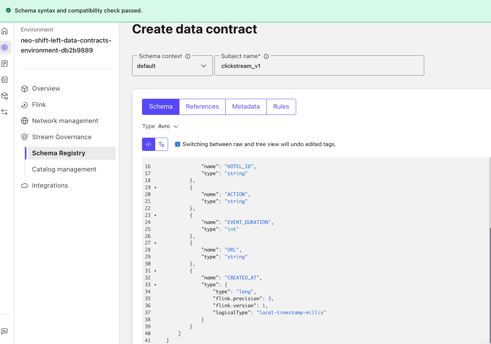

6. Click on the **Rules** tab
7. Click on the **Add rules** button
8. Add a new Data quality rule per this spec:

```json
{
   "name": "validateActionValue",
   "kind": "CONDITION",
   "type": "CEL",
   "mode": "WRITE",
   "expr": "message.ACTION.matches('^(page-view|page-click|booking-click)$')",
   "onFailure": "DLQ",
   "params": {
      "dlq.topic": "invalid-messages"
}
```

   Your *Add Rule* form should look similar to this:

   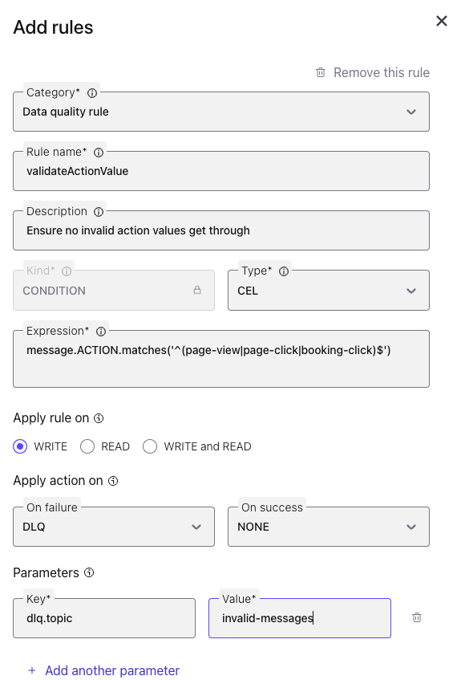

9. Click the **Add** button
10. Click **Create** to establish the contract

#### Add Business Context

Connect your technical schema to business ownership and governance.

1. Click **+ Add business metadata** in the right panel
2. Select `Stewardship` from the dropdown
3. Fill in ownership information:
   - *First_Name:* Your first name
   - *Last_Name:* Your last name
   - *Email:* Your email address

   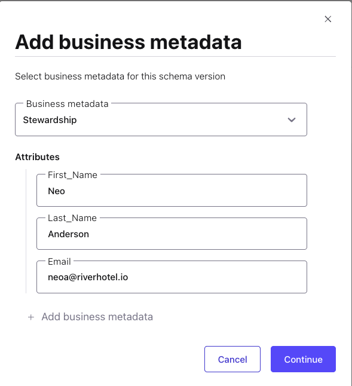

4. Click **Continue**
5. Confirm your Schema looks similar to this:

   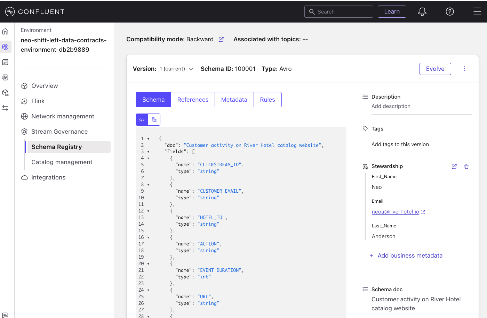

**Learning Impact:** This highlights how every data contract can have clear ownership, enabling rapid issue resolution and governance accountability.

### Step 3: Create Clickstream Topic with Contract Association

Now you'll create the Kafka topic that will use your data contract for governance.

#### Create the Topic

1. Click **Overview** in the left menu to return to your environment
2. Click on your workshop cluster
3. Click **Topics** in the left menu
4. Click **Create topic**
5. Configure the topic:
   - *Topic name:* `clickstream`
   - Leave other settings as defaults

   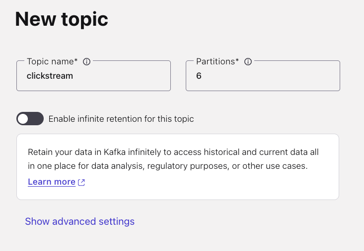

6. Click **Create with defaults**

#### Verify Contract Association

1. Find the `clickstream` topic in your topics list
2. Click on the topic name
3. Click the **Data contracts** tab
4. Verify you see **Version 1** of your schema associated

   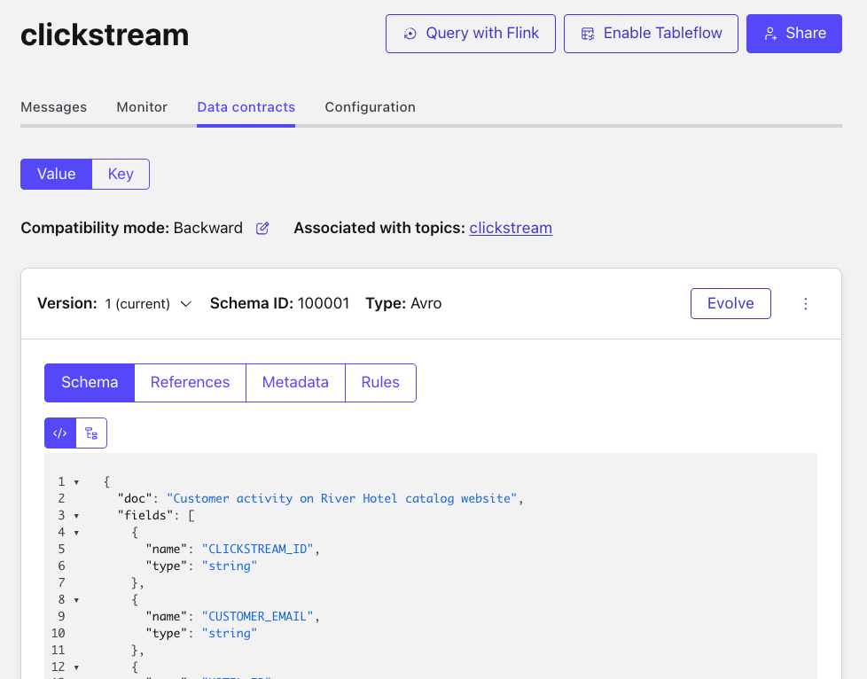

**Critical Success:** Your topic is now protected by the data contract. Any data that doesn't match the schema will be rejected.

### Step 4: Create DLQ Topic

Based on the DLQ topic `invalid-messages` you specified in the Data quality rule you created earlier, go ahead and create a topic titled `invalid-messages`.

## 🏁 Conclusion

**Outstanding work!** You've transformed River Hotels from an ungoverned data environment into a governed ecosystem.

### What You've Achieved

Your data platform now has:

✅ **Schema Governance**: Centralized contract management prevents breaking changes

✅ **Data Ownership**: Clear accountability through business metadata

✅ **Quality Enforcement**: Schema validation prevents bad data propagation

✅ **Business Context**: Technical schemas linked to business stakeholders

#### The Transformation

**Before (LAB 1):**

Data flowed without governance, vulnerable to quality issues

**After (LAB 2):**

Schema contracts prevent data quality problems at the source

#### The Shift-Left Success

You've implemented the core principle of shift-left data governance: **prevent problems at the source rather than fix them downstream**.

## What's Next

In [LAB 3](./LAB3_data_generation.md), you'll test your data contracts framework with realistic data generation, proving that your governance controls work in practice while enabling business innovation.
