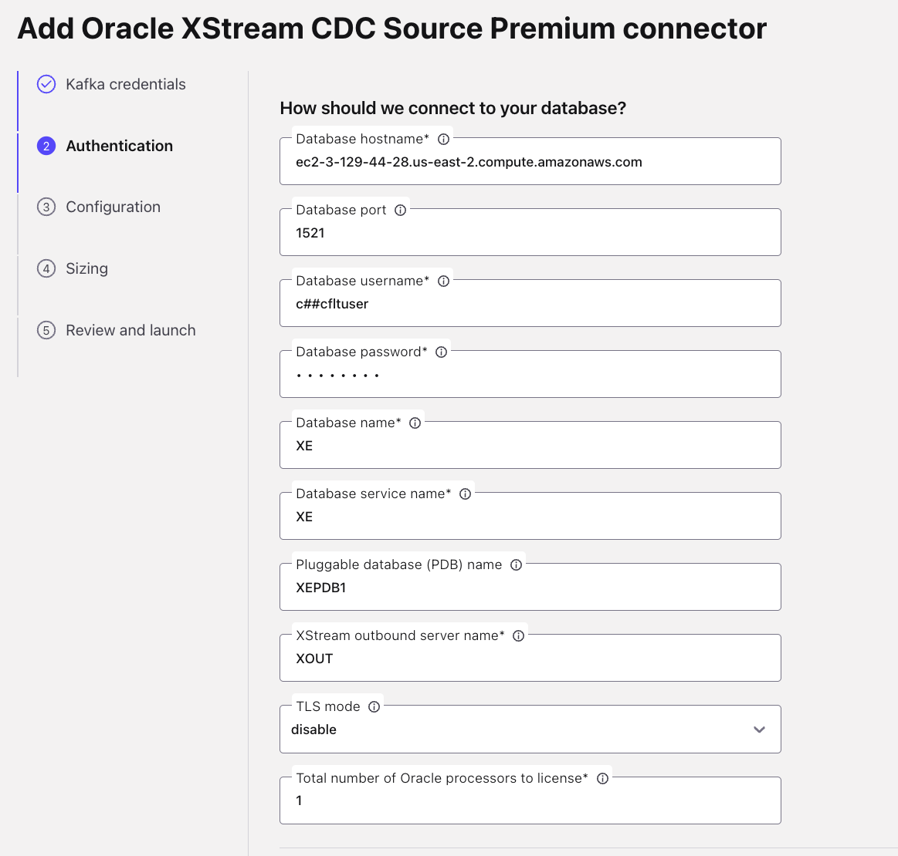
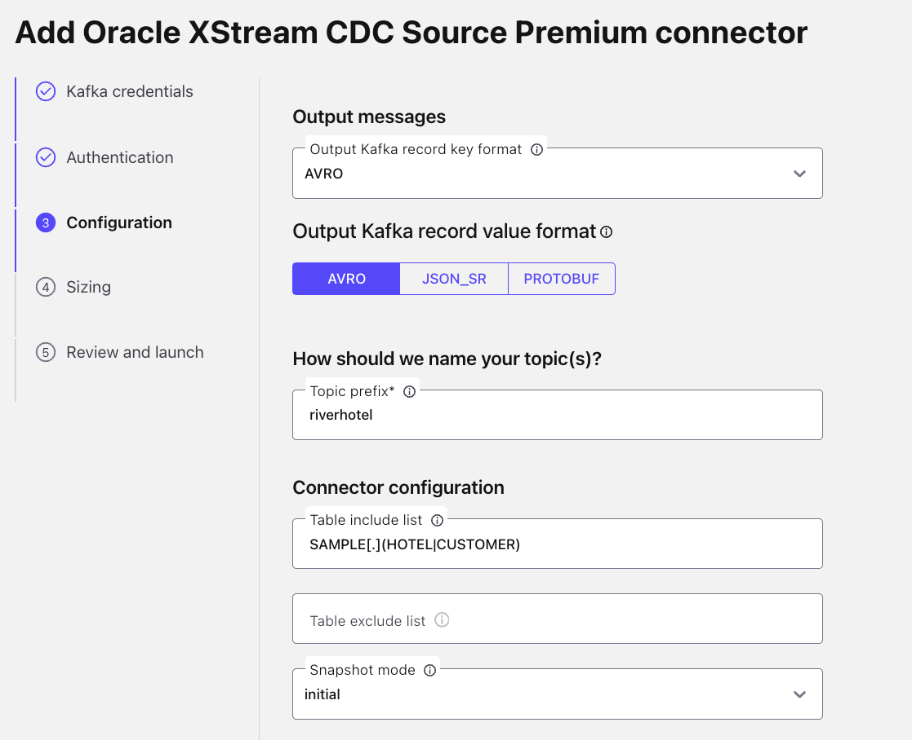

# LAB 3: Validate Data Contracts with Realistic Data

## 🗺️ Overview

Validate your data contracts framework using realistic data scenarios. This lab demonstrates how properly implemented contracts prevent data quality issues while allowing legitimate data evolution. You'll generate hospitality industry data and prove your governance controls work in practice.

### What You'll Accomplish

By the end of this lab, you will have:

1. **Oracle Integration**: Configure change data capture for customer and hotel data
2. **Realistic Data Generation**: Create hospitality industry data patterns using ShadowTraffic
3. **Contract Validation**: Test schema enforcement with compliant data streams
4. **Data Product Creation**: Build streaming analytics on trusted, governed data

### Key Technologies You'll Use

- **Oracle XStream CDC**: Enterprise database with real-time change data capture
- **ShadowTraffic**: Advanced data generation tool for creating realistic, interconnected synthetic datasets
- **Apache Flink SQL**: Stream processing and real-time analytics
- **Confluent Data Contracts**: Schema governance and quality enforcement

### The Business Value

Demonstrate to stakeholders how data contracts enable innovation while preventing costly pipeline failures. Your governance framework allows teams to trust data products because quality is enforced at the source.

### Prerequisites

- Completed [LAB 1](./LAB1_setup_terraform.md) with infrastructure deployed
- Completed [LAB 2](./LAB2_data_organization.md) with data contracts implemented
- Confluent Cloud cluster running with schema registry enabled
- Oracle database deployed and accessible

## 👣 Steps

### Step 1: Configure Oracle Change Data Capture

First, you'll establish real-time data streaming from your Oracle database to capture customer and hotel changes.

#### Navigate to Connectors

1. Navigate to your workshop cluster
2. Click **Connectors** in the left sidebar menu
3. Enter `XStream` in the search field
4. Select the **Oracle XStream CDC Source Premium** connector (with Oracle logo)

   

#### Generate API Key for Connector

1. Select **My account** for the API key scope
2. Click **Generate API key and download**
3. Click **Continue**

> [!TIP]
> **API Key Security**
>
> The downloaded credentials file can be deleted after setup - the keys are automatically associated with your connector.

#### Configure Oracle Connection

Get your Oracle connection details from Terraform:

```sh
terraform output oracle_xstream_connector
```

Use these values to configure the connector:

1. **Database Connection**:
   - *Database hostname*: Use `database_hostname` from Terraform output
   - *Database port*: Use `database_port` from Terraform output
   - *Database username*: Use `database_username` from Terraform output
   - *Database password*: Use `database_password` from Terraform output
   - *Database name*: Use `database_name` from Terraform output
   - *Database service name*: Use `database_service_name` from Terraform output
   - *Pluggable database (PDB) name*: Use `pluggable_database_name` from Terraform output
   - *XStream outbound server name*: Use `xstream_outbound_server` from Terraform output
   - *Total number of Oracle processors*: `1`

   

2. Click **Continue**

#### Configure Message Format and Tables

1. **Output Format**:
   - *Output Kafka record key format*: Select `AVRO`
   - *Output Kafka record value format*: Select `AVRO`

2. **Topic Configuration**:
   - *Topic prefix*: `riverhotel`
   - *Table include list*: `SAMPLE[.](HOTEL|CUSTOMER)`

   

3. Click **Continue**

#### Finalize Connector Setup

1. *Max tasks*: `1`
2. Click **Continue**
3. *Connector name*: `River_Hotel_Oracle_CDC`
4. Click **Continue**

The connector will take ~5 minutes to initialize. Wait for **Running** status:


**Success!** Your Oracle database changes now stream automatically to Kafka topics:

- `riverhotel.SAMPLE.CUSTOMER` - Customer data changes
- `riverhotel.SAMPLE.HOTEL` - Hotel data changes

### Step 2: Generate Baseline Data with Shadow Traffic

Now you'll generate realistic clickstream data that complies with your data contracts.

#### Understanding the Data Generation

Your Shadow Traffic configuration creates:

1. **Customer and Hotel Data**: Seeded into Oracle database (captured by CDC)
2. **Clickstream Data**: Streamed directly to Kafka using database lookups for realism

#### Execute Data Generation

Open a new shell window in your workshop root directory and run:

**Linux/Mac:**

```sh
docker run --env-file ./data/shadow_traffic_license.env \
  -v "$(pwd)/data/:/home/data" \
  shadowtraffic/shadowtraffic:1.1.1 \
  --config /home/data/river_hotel_data.json
```

**Windows CMD:**

```sh
docker run --env-file ./data/shadow_traffic_license.env \
  -v "%cd%/data/:/home/data" \
  shadowtraffic/shadowtraffic:1.1.1 \
  --config /home/data/river_hotel_data.json
```

**Windows PowerShell:**

```sh
docker run --env-file ./data/shadow_traffic_license.env \
  -v "${PWD}/data/:/home/data" \
  shadowtraffic/shadowtraffic:1.1.1 \
  --config /home/data/river_hotel_data.json
```

You should see successful completion:


> [!NOTE]
> **Staged Data Generation**
>
> Shadow Traffic runs in two stages:
>
> 1. **Seed Stage**: Populates Oracle with customer/hotel data
> 2. **Stream Stage**: Generates clickstream data using Oracle lookups for realism

### Step 3: Verify Data Contract Compliance

Confirm that your data contracts are working by examining the streaming data.

#### Review Topic Creation

1. Navigate to your Confluent Cloud cluster
2. Click **Topics** in the left sidebar
3. Verify you see these topics:

   | Topic Name | Description | Source |
   |------------|-------------|---------|
   | `clickstream` | Customer web activity | Shadow Traffic |
   | `riverhotel.SAMPLE.CUSTOMER` | Customer profiles | Oracle CDC |
   | `riverhotel.SAMPLE.HOTEL` | Hotel information | Oracle CDC |

   

#### Examine Data Quality

1. Click on the `clickstream` topic
2. Click the **Messages** tab
3. Observe the data structure matches your schema contract:

   ```json
   {
     "CLICKSTREAM_ID": "uuid-string",
     "CUSTOMER_EMAIL": "valid@email.com",
     "HOTEL_ID": "hotel-uuid",
     "ACTION": "page-view|page-click|booking-click",
     "EVENT_DURATION": 123,
     "URL": "/hotels/hotel-uuid",
     "CREATED_AT": 1640995200000
   }
   ```

2. **Verify Schema Compliance**:
   - Data types match your contract (strings, integers, etc.)
   - ACTION values use the expected format
   - No schema validation errors appear

**Critical Success:** Your data contracts are preventing bad data from entering the system!

### Step 4: Build Data Products on Trusted Data

Now create streaming analytics that **demonstrate the learning value** of governed data **in your proof-of-concept**.

#### Access Flink SQL Workspace

1. Navigate to your workshop Confluent environment
2. Click **Flink** in the left navigation
3. Click **Open SQL workspace** on your compute pool
4. Ensure your environment and cluster are selected in the respective **Catalog** and **Database** dropdowns

   

#### Explore the Data Streams

Start by examining your governed data streams by pasting these queries into the SQL editor cells:

```sql
-- View clickstream data
SELECT * FROM `clickstream` LIMIT 10;
```

```sql
-- View customer data from Oracle CDC
SELECT * FROM `riverhotel.SAMPLE.CUSTOMER` LIMIT 10;
```

```sql
-- View hotel data from Oracle CDC
SELECT * FROM `riverhotel.SAMPLE.HOTEL` LIMIT 10;
```

**Observation:** All data matches expected schemas because your contracts enforce quality at ingestion.

#### Create High-Value Customer Data Product

Next, you will create a data product that identifies customers who, in the last 2 weeks, showed interest in a hotel but haven't booked it yet.

Copy and paste this statement into a cell and execute it to create the `target_customers` table:

```sql
CREATE TABLE target_customers  (
   CUSTOMER_EMAIL STRING,
   HOTEL_ID STRING,
   CUSTOMER_FIRST_NAME STRING,
   HOTEL_NAME STRING,
   latest_view_time TIMESTAMP,
   view_count BIGINT,
   total_page_clicks BIGINT,
   booking_clicks BIGINT,
   PRIMARY KEY (CUSTOMER_EMAIL, HOTEL_ID) NOT ENFORCED
 ) AS (
SELECT
    CUSTOMER_EMAIL,
    HOTEL_ID,
    CUSTOMER_FIRST_NAME,
    HOTEL_NAME,
    latest_view_time,
    view_count,
    total_page_clicks,
    booking_clicks
FROM (
    SELECT
        click.CUSTOMER_EMAIL,
        cust.FIRST_NAME AS CUSTOMER_FIRST_NAME,
        click.HOTEL_ID,
        hot.NAME AS HOTEL_NAME,
        MAX(CASE WHEN click.ACTION = 'page-view' THEN click.CREATED_AT END) as latest_view_time,
        COUNT(CASE WHEN click.ACTION = 'page-view' THEN 1 END) as view_count,
        COUNT(CASE WHEN click.ACTION = 'page-click' THEN 1 END) as total_page_clicks,
        COUNT(CASE WHEN click.ACTION = 'booking-click' THEN 1 END) as booking_clicks
    FROM clickstream AS click
    JOIN `riverhotel.SAMPLE.CUSTOMER` as cust
       ON cust.EMAIL = click.CUSTOMER_EMAIL
    JOIN `riverhotel.SAMPLE.HOTEL` as hot
       ON click.HOTEL_ID = hot.HOTEL_ID
    WHERE click.CREATED_AT >= CURRENT_TIMESTAMP - INTERVAL '14' DAY
    GROUP BY CUSTOMER_EMAIL, cust.FIRST_NAME, click.HOTEL_ID, hot.NAME
)
WHERE view_count > 0           -- Must have viewed the hotel
  AND booking_clicks = 0       -- But have not tried to book
);
```

#### Verify Your Data Product

Execute this query to get a list of our target_customers:

```sql
SELECT
    *
FROM target_customers
LIMIT 20;
```

You should see a list of customers and the hotel they are interested in.

#### Prepare for Tableflow

> [!IMPORTANT]
> **Append Changelog Mode**
>
> By default, topics in Confluent Flink have their `changelog.mode` set to `retract`.  However, Tableflow [currently supports](https://docs.confluent.io/cloud/current/topics/tableflow/overview.html#limitations-in-open-preview) *append-only* tables, you need to alter the [changelog mode](https://docs.confluent.io/cloud/current/flink/reference/statements/create-table.html#changelog-mode) to `append` for the topics you want to stream as Delta Lake tables by executing these statements individually in a Flink cell:
>
> This means you need need to execute the statement below for compatibility:

```sql
ALTER TABLE `target_customers` SET ('changelog.mode' = 'append');
```

Now your schematized and governed data product is ready for downstream analytics consumption!

## 🏁 Conclusion

**Exceptional work!** You've demonstrated that data contracts enable both governance and innovation.

### What You've Achieved

Your data platform now proves:

✅ **Quality at Source**: Data contracts prevent issues before they propagate

✅ **Business Innovation**: Trusted data enables confident analytics

✅ **Real-time Integration**: CDC provides fresh data for decision-making

✅ **Realistic Testing**: Synthetic data validates contracts work in practice

## What's Next

In [LAB 4](./LAB4_data_schema_evolution.md), you'll test your governance framework against real-world challenges including schema evolution, data quality violations, and system changes that commonly cause production issues.
