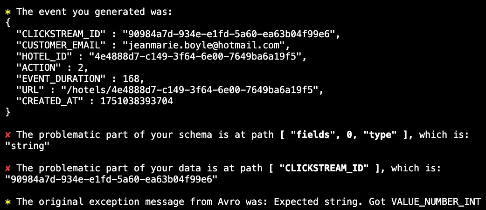
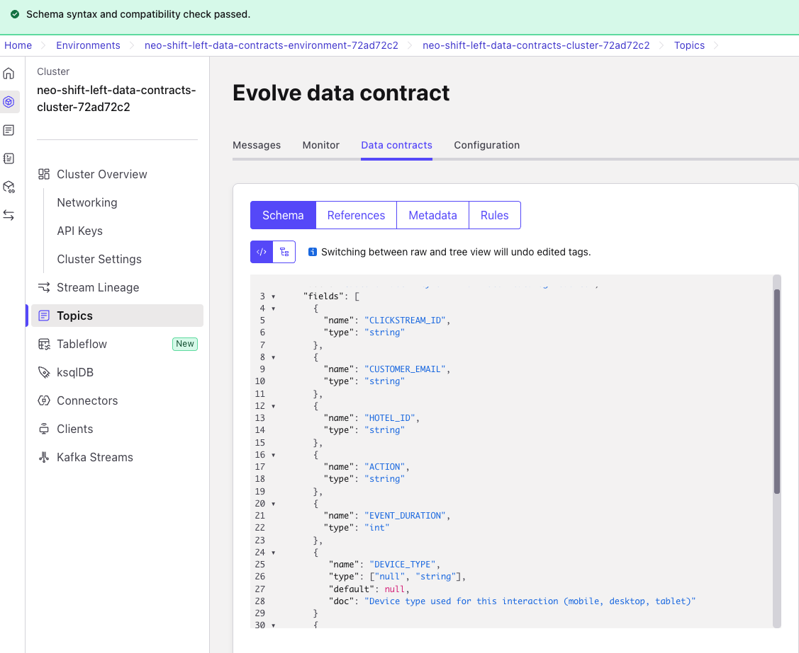
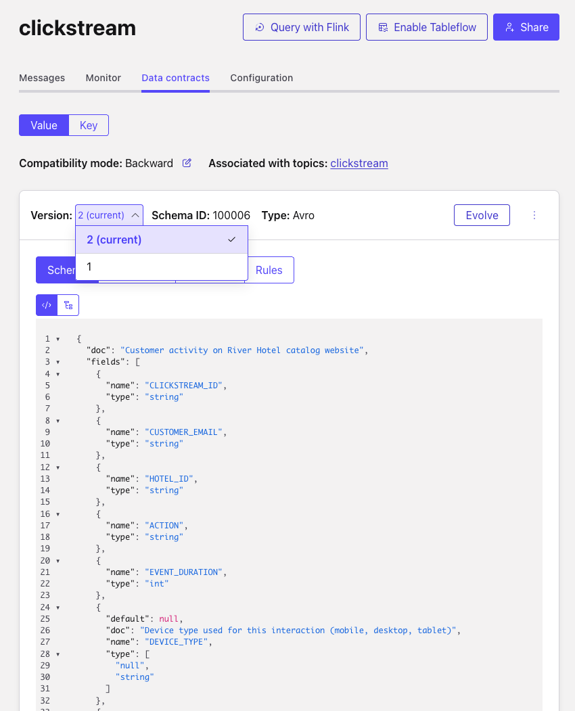

# LAB 4: Test Data Schema Evolution and Contract Enforcement

## 🗺️ Overview

Test your data contracts framework against real-world challenges that commonly cause production failures. This lab demonstrates how properly governed schemas enable safe evolution while preventing breaking changes from disrupting downstream systems.

### What You'll Accomplish

By the end of this lab, you will have:

1. **Contract Violation Detection**: Demonstrate how contracts prevent bad data from entering the system
2. **Schema Evolution Testing**: Safely evolve schemas using compatibility rules

### Key Technologies You'll Use

- **Schema Registry Compatibility Rules**: Forward, backward, and full compatibility management
- **ShadowTraffic**: Advanced data generation tool for creating realistic, interconnected synthetic datasets

### The Business Impact

**Before:** Schema changes break downstream systems without warning, causing costly outages and data corruption

**After:** Controlled evolution **demonstrates** how innovation can happen while maintaining system stability

**Note**: This lab focuses on **testing governance concepts** and **validating learning outcomes** rather than production deployment patterns.

### Prerequisites

- Completed [LAB 1](./LAB1_setup_terraform.md) with infrastructure deployed
- Completed [LAB 2](./LAB2_data_organization.md) with data contracts created
- Completed [LAB 3](./LAB3_data_generation.md) with data flowing through contracts
- Understanding of schema compatibility concepts

## 👣 Steps

You'll test three scenarios that commonly occur in production environments to validate your data contracts framework.

**Test Scenario 1: Breaking Schema Change**

- **Objective**: Demonstrate how schema registry prevents incompatible changes
- **Action**: Change clickstream.ACTION from strings to integers (1, 2, 3)
- **Expected Result**: Producer rejection prevents data from entering topic
- **Learning**: Schema registry prevents incompatible changes at the source

**Test Scenario 2: Compatible Schema Evolution**

- **Objective**: Demonstrate safe schema evolution practices
- **Action**: Add optional field to clickstream schema
- **Expected Result**: New field accepted, backward compatibility maintained
- **Learning**: Proper evolution enables innovation without breaking existing consumers

### Step 1: Create Breaking Schema Change (Negative Test)

First, you'll attempt a breaking change to demonstrate how contracts protect downstream systems.

#### Attempt Breaking Schema Change at Producer

In a code editor of your choice, open the Clickstream data generator [configuration](../../data/generators/clickstream_generator.json#L68-84) file and change the type of value for the `ACTION` field to an integer without changing the associated schema.

**Before:**

```json
"ACTION": {
   "_gen": "weightedOneOf",
   "choices": [
         {
            "weight": 5,
            "value": "page-view"
         },
         {
            "weight": 3,
            "value": "page-click"
         },
         {
            "weight": 2,
            "value": "booking-click"
         }
   ]
},
```

**After:**

```json
"ACTION": {
   "_gen": "weightedOneOf",
   "choices": [
         {
            "weight": 5,
            "value": 1
         },
         {
            "weight": 3,
            "value": 2
         },
         {
            "weight": 2,
            "value": 3
         }
   ]
},
```

Rerun the docker command to invoke the Shadow Traffic data generator:

**Linux/Mac:**

```sh
docker run --env-file ./data/shadow_traffic_license.env \
  -v "$(pwd)/data/:/home/data" \
  shadowtraffic/shadowtraffic:1.1.1 \
  --config /home/data/river_hotel_data.json
```

**Windows CMD:**

```sh
docker run --env-file ./data/shadow_traffic_license.env \
  -v "%cd%/data/:/home/data" \
  shadowtraffic/shadowtraffic:1.1.1 \
  --config /home/data/river_hotel_data.json
```

**Windows PowerShell:**

```sh
docker run --env-file ./data/shadow_traffic_license.env \
  -v "${PWD}/data/:/home/data" \
  shadowtraffic/shadowtraffic:1.1.1 \
  --config /home/data/river_hotel_data.json
```

Verify that you see an error similar to this:



### Step 2: Implement Safe Schema Evolution

Now you'll demonstrate how to safely evolve schemas using compatibility rules.

#### Add Optional Field (Safe Evolution)

In this step you will add this new optional field to the clickstream schema to track user device information:

```json
{
      "name": "DEVICE_TYPE",
      "type": ["null", "string"],
      "default": null,
      "doc": "Device type used for this interaction (mobile, desktop, tablet)"
}
```

#### Access Clickstream Data Contract

1. Navigate to the *clickstream* topic in Confluent Cloud
2. Click on the **Data contracts** tab
3. Click on the **Evolve** button
4. Copy and paste this complete schema with the new field:

```json
{
      "type": "record",
      "namespace": "com.riverhotel.poc",
      "name": "clickstreamEvent",
      "doc": "Customer activity on River Hotel catalog website",
      "fields": [
         {
            "name": "CLICKSTREAM_ID",
            "type": "string"
         },
         {
            "name": "CUSTOMER_EMAIL",
            "type": "string"
         },
         {
            "name": "HOTEL_ID",
            "type": "string"
         },
         {
            "name": "ACTION",
            "type": "string"
         },
         {
            "name": "EVENT_DURATION",
            "type": "int"
         },
         {
            "name": "DEVICE_TYPE",
            "type": ["null", "string"],
            "default": null,
            "doc": "Device type used for this interaction (mobile, desktop, tablet)"
         },
         {
            "name": "URL",
            "type": "string"
         },
         {
            "name": "CREATED_AT",
            "type": {
                  "type": "long",
                  "flink.precision": 3,
                  "flink.version": 1,
                  "logicalType": "local-timestamp-millis"
            }
         },
         {
            "name": "DEVICE_TYPE",
            "type": ["null", "string"],
            "default": null,
            "doc": "Device type used for this interaction (mobile, desktop, tablet)"
         }
      ]
}
```

5. Click **Validate schema**
6. **Observe successful validation**:

   

   The validation succeeds because:
   - Adding optional fields maintains backward compatibility
   - Existing consumers can continue working
   - New consumers can leverage the additional field

7. Click **Create** to deploy Version 2 of your schema

   

## 🏁 Conclusion

**Outstanding achievement!** You've demonstrated production-ready data governance that prevents common causes of pipeline failures.

### Learning Value Demonstrated

Your stakeholders can now see:

- **Reduced Risk**: Governance prevents costly production failures
- **Faster Innovation**: Safe evolution enables rapid feature development
- **Data Trust**: Quality rules ensure analytics accuracy
- **Operational Excellence**: Automated governance reduces manual validation

## What's Next

In [LAB 5](./LAB5_tableflow_databricks.md), you'll demonstrate the business value of your data contracts framework by streaming governed data to Databricks for analytics and AI-powered insights, showing that governance enables rather than hinders innovation.
