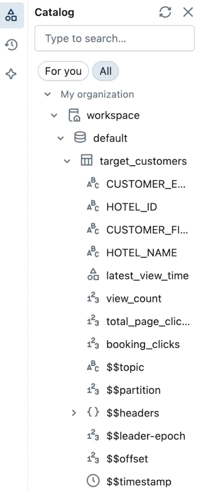

# LAB 5: Analytics with Tableflow and Databricks

## 🗺️ Overview

Transform your governed data streams into actionable business insights using Confluent Tableflow and Databricks. This lab demonstrates how properly governed data contracts enable confident analytics by automatically streaming trusted data to your analytics platform.

### What You'll Accomplish

By the end of this lab, you will have:

1. **Tableflow Integration**: Stream governed data from Confluent topics to S3 as Delta tables
2. **Databricks External Tables**: Create analytics-ready tables sourced from Confluent-managed Delta tables
3. **AI-Powered Analytics**: Use Databricks Genie to derive business insights through natural language queries
4. **End-to-End Data Pipeline**: Complete the journey from source data to business intelligence

### Key Databricks Technologies You'll Experience

- **Confluent Tableflow**: Automated streaming from Kafka topics to cloud storage as Delta tables
- **Databricks Unity Catalog**: Centralized governance and metadata management
- **Delta Lake**: Open-source storage layer providing ACID transactions for analytics
- **Databricks Genie**: AI-powered analytics interface for natural language data exploration

### The Business Value

This lab proves that data contracts enable trusted analytics by ensuring data quality at the source. Your stakeholders can confidently build insights knowing the underlying data has been validated and governed throughout the pipeline.

### Prerequisites

- Completed [LAB 1](./LAB1_setup_terraform.md) with infrastructure deployed
- Completed [LAB 2](./LAB2_data_organization.md) with data contracts implemented
- Completed [LAB 3](./LAB3_data_generation.md) with data flowing through contracts
- Completed [LAB 4](./LAB4_data_schema_evolution.md) with schema evolution tested
- Databricks workspace configured with Unity Catalog access

## 👣 Steps

### Step 1: Enable Tableflow

Now that you have created enriched datasets, you can now more easily derive insights from them with powerful analytical tools and platforms like Databricks.

Your next step is to send the relevant datasets to Databricks by streaming the `target_customer` topic using **TableFlow**!

1. Locate the row of your newly-created `target_customers` topic
2. Click on the *Enable Tableflow* link under the *Tableflow* column
3. Select the *Delta* tile

   

4. Click on the *Configure custom storage* button
5. Select the *Store in your own bucket* option
6. Select the *tableflow-databricks* provider integration from the dropdown
7. In your command-line interface in the *terraform* directory run `terraform output aws_s3`
8. Copy the value from the `name` property and paste it into the *AWS S3 Bucket name* textbox

    Your selections should look like this:
    

9.  Click on the *Continue* button
10.  Review the configuration details and click the *Launch* button
11.  Verify Tableflow is successfully syncing data by checking the status in the UI.

   

12.  Repeat steps 5-15 for the `clickstream` topic

> [!IMPORTANT]
> **Tableflow Sync Startup Time**
>
> It should take only a few minutes for Tableflow to connect to S3 and begin streaming your topics as tables.
>
> However, in some cases it may take longer, and you will see a *Tableflow sync pending* message like this:
> 
>
> While this sync is pending, you can move on to the next lab but you will not be able to pull in data until the sync is successful.

### Step 2: Create Local Tables Sourced from S3 Delta Tables

You'll connect your streaming Delta tables from Confluent Tableflow to Databricks for analytics and AI processing.

#### Get S3 URIs from Confuent Tableflow

First, find the S3 URIs with these steps:

1. Navigate to the *Topics* page
2. Click on one of the `target_customers` topic
3. Click on the *Monitor* tab
4. Find the *Tableflow details* tile and expand it
5. Click the *copy* icon next to the the *Storage Location* and use in the next section

   

#### Source Tableflow Topics into Databricks as External Tables

1. Login to your Databricks workspace
2. Click on *SQL Editor* in the left navigation
3. Select the appropriate **catalog** and **database** in the editor dropdown. For those using trial or free accounts, this will likely be `workspace` and `default` respectively
4. Copy and paste the Delta table storage location in S3 that you copied previously from Confluent Cloud and replace the placeholder `<< >>` with it

```sql
CREATE TABLE target_customers
    USING DELTA
    LOCATION '<<S3 URI from Tableflow>>';
```

5. Verify the table was created successfully.  If not, review the [Databricks troubleshooting guide](./troubleshooting.md#databricks) for help.

6. Review the table schema by expanding the table in the *Catalog explorer*

   

7. Check to see if any data is available by executing this command:

```sql
SELECT * FROM <<table_name>> LIMIT 10;
```

> [!IMPORTANT]
> **Data Sync Delay**
>
> It may take 5-10 minutes for the above `SELECT` queries to return data in the results. You may need to wait for the next steps while the data is pulled in.

### Step 3: Derive Data Product Insights with Genie

Databricks Genie makes it more accessible and easier to obtain data insights.  It provides a chat interface where you ask questions about your data in natural language, and it leverages generative AI to parse your questions and answer them through SQL queries it generates.

#### Set Up Genie Workspace

Follow these steps to set Genie up:

1. Click on the *Genie* link under the *SQL* section in the left sidebar
2. Click on the *+ New* button in the top right of the screen to create a new Genie space
3. Click on the *All* toggle
4. Navigate to your workshop *catalog* and *database* (e.g. `workspace` and `default`)
5. Select the `target_customers` table

   

6. Click on the *Create* button
7. Rename your space to something like *River Hotel BI*

#### Generate Business Insights

Prompt Genie for insights about the data using natural language and following these steps.

1. Click on the **Explain the data set** button
2. Click on additional prompts from Genie
3. Ask it this question
   > Which customers are the most interested in hotels?

## 🏁 Conclusion

**Outstanding achievement!** You've completed the end-to-end data contracts implementation, proving that governance enables rather than hinders business innovation.

### What You've Achieved

Your data platform now demonstrates:

✅ **Trusted Analytics**: Data contracts ensure reliable downstream analytics

✅ **Automated Streaming**: Tableflow provides real-time data delivery without manual intervention

✅ **AI-Powered Insights**: Genie makes data accessible to business users through natural language

✅ **Complete Governance**: From source to insight, every step maintains data quality and trust

### The Business Impact

Your stakeholders can now see how data contracts deliver tangible business value:

- **Reduced Risk**: Quality issues caught at source prevent analytics errors
- **Faster Insights**: Automated streaming enables real-time business intelligence
- **Democratized Analytics**: AI tools make data accessible to non-technical users
- **Scalable Foundation**: Proven architecture supports future growth

## ➡️ What's Next

Now that you've completed the lab, it's time to clean up the resources you created by going through [LAB 6: Workshop Clean Up](./LAB6_tear_down.md).
